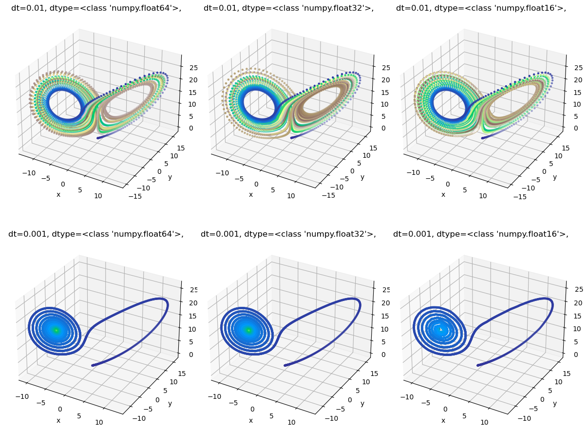
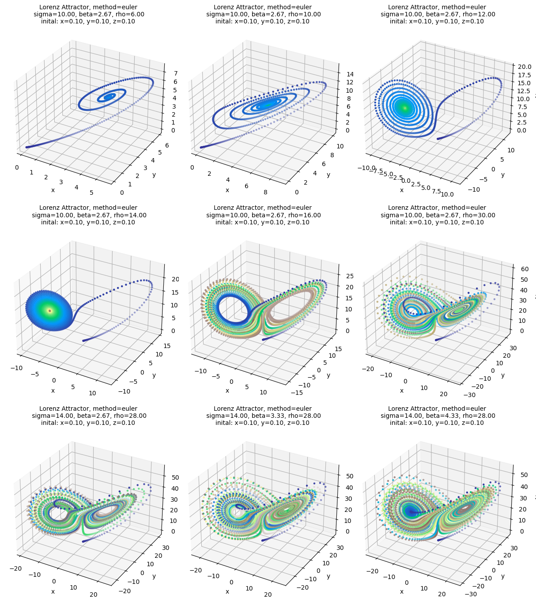
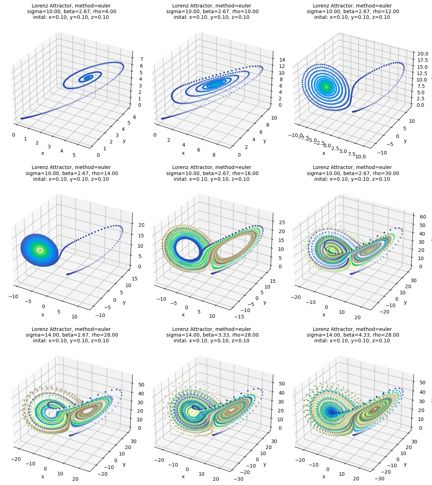

```python
import numpy as np
import matplotlib.pyplot as plt
from lorenz_attractor.lorenz_attractor import LorenzAttractor
import itertools

import lorenz_attractor.visualisation as vis

```


---
header-includes:
  - \usepackage{algorithm2e}
---
# The Lorenz Attractor
## Scientific Computing using Python

### by Søren Heidelbach
### on 2023-07-17


This project aims to implementation a module for the Lorentz Attractor. The module will be used to generate a plot of the attractor and a plot of the time evolution of the attractor. The module will also be used to generate a plot of the attractor for different values of the parameters. Unit testing will be used to ensure proper funcitonallity of the modeul.

---
## Introduction

The Lorenz Attractor is a system of differential equations that describes a chaotic system. The system was first described by Edward Lorenz in 1963. The system is described by the following equations:

$$
\begin{align}
\frac{dx}{dt} &= \sigma(y-x) \\
\frac{dy}{dt} &= x(\rho-z)-y \\
\frac{dz}{dt} &= xy-\beta z
\end{align}
$$

where $\sigma$, $\rho$ and $\beta$ are parameters.


Using eulers method, the system can be solved numerically. The system is solved by discretizing the time and using the following equations:

$$
\begin{align}
x_{n+1} &= x_n + \sigma(y_n-x_n)\Delta t \\
y_{n+1} &= y_n + (x_n(\rho-z_n)-y_n)\Delta t \\
z_{n+1} &= z_n + (x_ny_n-\beta z_n)\Delta t
\end{align}
$$

where $\Delta t$ is the time step.  The system is solved by iterating over the equations for a given number of time steps.


---
## Core algorithm

```
algorithm lorentz-attractor is
    input: Initial values: x0, y0, z0
           Parameters: sigma, rho, beta
           Time step: dt
           Number of time steps: nstep
    output: x, y, z at time t
    n = 0
    while n < nstep do
        x[n+1] = x[n] + sigma * (y[n] - x[n]) * dt
        y[n+1] = y[n] + (x[n] * (rho - z[n]) - y[n]) * dt
        z[n+1] = z[n] + (x[n] * y[n] - beta * z[n]) * dt
        n += 1
end algorithm
```

---
## Structure

The module is structured as follows:

```
lorentz-attractor/
├── __init__.py
├── lorentz.py
├── visualisation.py
test/
├── __init__.py
├── test_lorenz.py/
├── data/
│   ├── test_data
simulations/
├── out_simulations.npz
README.md
report.ipynb
report.pdf
report.md
```

├── test_lorentz_attractor.py


## Design considerations


## Test plan


```python
combinations = list(itertools.product([0.01, 0.001], [np.float64, np.float32, np.float16]))
vis.plot_multiple_settings(
    dtype=[i[1] for i in combinations],
    dt=[i[0] for i in combinations]
)
```


    

    


```python

vis.plot_multiple_settings(
    sigma = [10,  10,   10,   10,     10,     10,     14,  14,     14],
    beta =  [8/3, 8/3,  8/3,  8/3,    8/3,    8/3,    8/3, 10/3,    13/3],
    rho =   [6,   10,   12,   14,     16,     30,     28,  28,     28],
    initial = (0.1, 0.1, 0.1),
    dtype=np.float64
)
```


    

    


```python

vis.plot_multiple_settings(
    sigma = [10,  10,   10,   10,     10,     10,     14,  14,     14],
    beta =  [8/3, 8/3,  8/3,  8/3,    8/3,    8/3,    8/3, 10/3,    13/3],
    rho =   [6,   10,   12,   14,     16,     30,     28,  28,     28],
    initial = (0.1, 0.1, 0.1),
    dtype=np.float16
)
```


    

    


```python
def floating_point_error():
    a = 0.1 + 0.2
    b = 0.3

    # Check if a and b are equal
    if a == b:
        print("a and b are equal")
    else:
        print("a and b are not equal")

    print(f"a: {a}")
    print(f"b: {b}")

    # Check if a and b are 'close' in a numerical sense
    if abs(a - b) < 1e-9:
        print("However, a and b are close enough in a numerical sense")

floating_point_error()

```

    a and b are not equal
    a: 0.30000000000000004
    b: 0.3
    However, a and b are close enough in a numerical sense


```python
float(0.1 + 0.2) - float(0.3)
```


    5.551115123125783e-17


```python
np.float32(0.1 + 0.2) == np.float32(0.3)
```


    True


```python
test_dic = {
    "a": 2,
    "b": 5
}

max(test_dic.values())
```


    5


```python
for k, v in test_dic.items():
    print(k, v)
```

    a 2
    b 5


```python
f"bla {np.float32}"
```


    "bla <class 'numpy.float32'>"


